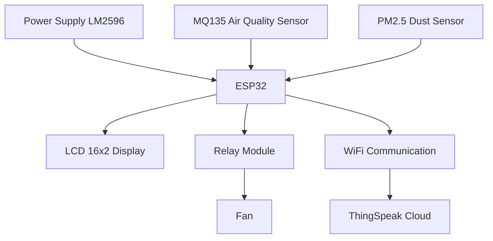

# IoT-Air-Pollution-Monitoring-System-ESP32
An IoT-based Air Pollution Monitoring System using ESP32, MQ135 and PM2.5 sensors for real-time air quality monitoring and cloud visualization through ThingSpeak.
# IoT Based Air Pollution Monitoring System

## Overview

This project is an IoT-based Air Pollution Monitoring System developed using ESP32, MQ135 Gas Sensor, PM2.5 Dust Sensor, LCD Display, and ThingSpeak Cloud Platform.

The system continuously monitors air quality parameters and sends real-time data to the cloud for remote monitoring and analysis. When pollution levels exceed predefined thresholds, a relay-controlled fan is automatically activated to improve air quality.

---

## Objectives

- Monitor air quality in real time
- Detect harmful gases and particulate matter
- Display sensor values on LCD
- Upload data to ThingSpeak cloud
- Automatically control ventilation fan
- Provide remote monitoring through IoT

---

## Hardware Components

- ESP32 Development Board
- MQ135 Air Quality Sensor
- PM2.5 Dust Sensor
- LCD 16x2 Display
- LM2596 DC-DC Buck Converter
- Relay Module
- Fan
- Power Supply

---

## Software Requirements

- Arduino IDE
- ThingSpeak Cloud Platform
- ExpressSCH / ExpressPCB

---

## Working Principle

1. MQ135 sensor detects harmful gases.
2. PM2.5 sensor measures dust concentration.
3. ESP32 collects and processes sensor data.
4. Air quality values are displayed on LCD.
5. Data is uploaded to ThingSpeak using Wi-Fi.
6. If pollution exceeds threshold value:
   - Relay activates
   - Fan turns ON automatically
7. Fan turns OFF when air quality returns to normal.

---

## Features

- Real-time Air Quality Monitoring
- Wi-Fi Enabled IoT System
- Cloud Data Logging
- Automatic Fan Control
- LCD Display Interface
- Low Power Consumption
- Remote Monitoring

---

## Block Diagram

---

## Circuit Diagram
MQ135 Sensor           ESP32
-----------           -----
VCC       ----------> 5V
GND       ----------> GND
A0        ----------> GPIO34 (ADC)

PM2.5 Sensor          ESP32
-------------         -----
VCC       ----------> 5V
GND       ----------> GND
OUT       ----------> GPIO35

LCD 16x2 (I2C)        ESP32
---------------       -----
VCC       ----------> 5V
GND       ----------> GND
SDA       ----------> GPIO21
SCL       ----------> GPIO22

Relay Module          ESP32
------------          -----
VCC       ----------> 5V
GND       ----------> GND
IN        ----------> GPIO26

Fan Connection
--------------
AC/DC Supply --> Relay COM
Relay NO     --> Fan
Fan          --> Supply Return

---

## Cloud Platform

ThingSpeak is used for:

- Real-time Monitoring
- Data Logging
- Graph Visualization
- Remote Access

---

## Applications

- Smart Cities
- Industrial Pollution Monitoring
- Indoor Air Quality Monitoring
- Environmental Monitoring
- Smart Buildings

## Circuit Flow
- MQ135 ----\
            \
PM2.5 -------> ESP32 ------> LCD Display
                 |
                 +------> WiFi ---> ThingSpeak Cloud
                 |
                 +------> Relay -----> Fan

---

## Future Scope

- Mobile Application Integration
- AI-based Pollution Prediction
- GPS Location Tracking
- SMS/Email Alert System
- Advanced Air Quality Analytics

---

## Team Members

- Kalyani Rajwadkar
- Arpita Bhongade
- Kalyani Jadhav
  

---

## Department

Department of Electronics and Telecommunication Engineering

---

## License

This project is developed for academic and educational purposes.
